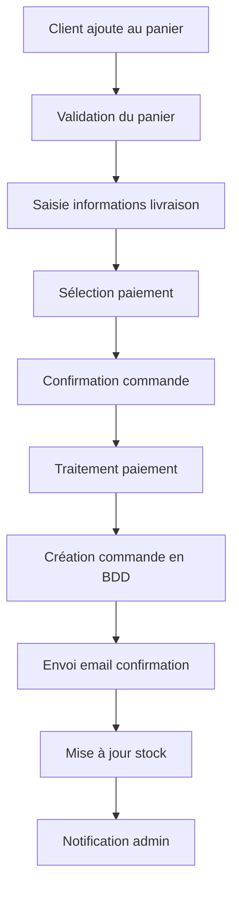
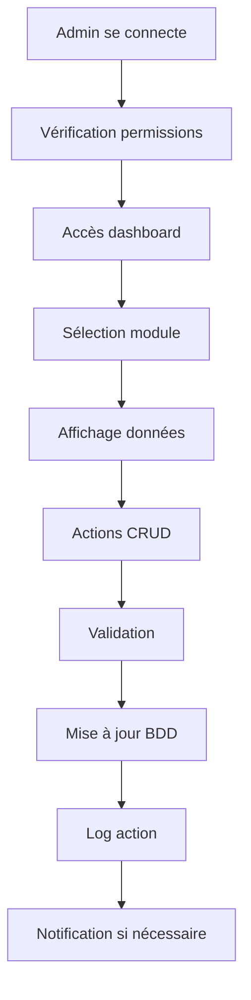

# Spécifications Fonctionnelles - Gestion des Commandes et Interface d'Administration

## 📋 Vue d'ensemble

Ce document définit les spécifications détaillées pour l'implémentation de deux modules critiques dans l'application Samurai Nutrition :

1. **Système de Gestion des Commandes** - Module complet pour le traitement des commandes clients
2. **Interface d'Administration** - Tableau de bord administrateur pour la gestion de l'application

## 🛒 Module de Gestion des Commandes

### 1.1 Objectifs Fonctionnels

Le système de gestion des commandes doit permettre aux clients de :
- Passer des commandes de manière fluide et sécurisée
- Suivre l'état de leurs commandes en temps réel
- Gérer leur historique de commandes
- Recevoir des notifications sur l'évolution de leurs commandes

### 1.2 Fonctionnalités Côté Client

#### 1.2.1 Processus de Commande
- **Validation du panier** : Vérification des quantités et disponibilités
- **Informations de livraison** : Saisie et validation des adresses
- **Méthodes de paiement** : Intégration de solutions de paiement sécurisées
- **Confirmation de commande** : Récapitulatif détaillé avant validation
- **Génération de facture** : Création automatique de documents PDF

#### 1.2.2 Suivi des Commandes
- **Statuts de commande** : En attente, Confirmée, En préparation, Expédiée, Livrée, Annulée
- **Notifications** : Emails automatiques à chaque changement de statut
- **Tracking** : Intégration avec les transporteurs pour le suivi en temps réel
- **Historique** : Consultation de toutes les commandes passées

#### 1.2.3 Gestion des Retours
- **Demande de retour** : Interface pour initier un retour
- **Motifs de retour** : Sélection parmi une liste prédéfinie
- **Statut de retour** : Suivi du processus de retour
- **Remboursement** : Gestion automatisée des remboursements

### 1.3 Fonctionnalités Côté Administration

#### 1.3.1 Gestion des Commandes
- **Vue d'ensemble** : Dashboard avec métriques clés
- **Liste des commandes** : Filtrage et recherche avancés
- **Détails de commande** : Vue complète avec historique des actions
- **Modification de statut** : Mise à jour manuelle ou automatique
- **Gestion des stocks** : Déduction automatique lors de la validation

#### 1.3.2 Traitement des Commandes
- **Validation automatique** : Vérification des paiements et stocks
- **Préparation** : Interface pour l'équipe logistique
- **Expédition** : Génération d'étiquettes et intégration transporteurs
- **Facturation** : Génération et envoi automatique des factures

## 🔧 Interface d'Administration

### 2.1 Objectifs Fonctionnels

L'interface d'administration doit permettre aux administrateurs de :
- Gérer l'ensemble des données de l'application
- Superviser les activités des utilisateurs
- Analyser les performances commerciales
- Configurer les paramètres système

### 2.2 Dashboard Principal

#### 2.2.1 Métriques Clés
- **Chiffre d'affaires** : Journalier, hebdomadaire, mensuel
- **Nombre de commandes** : Évolution et comparaisons
- **Utilisateurs actifs** : Nouveaux inscrits et connexions
- **Produits populaires** : Top des ventes et tendances
- **Taux de conversion** : Visiteurs vers clients

#### 2.2.2 Graphiques et Visualisations
- **Courbes de vente** : Évolution temporelle du CA
- **Répartition géographique** : Carte des ventes par région
- **Analyse des produits** : Performance par catégorie
- **Comportement utilisateur** : Parcours et abandons

### 2.3 Gestion des Utilisateurs

#### 2.3.1 Liste des Utilisateurs
- **Recherche et filtrage** : Par nom, email, statut, date d'inscription
- **Informations détaillées** : Profil complet et historique d'activité
- **Actions administratives** : Activation, désactivation, suppression
- **Rôles et permissions** : Attribution de droits spécifiques

#### 2.3.2 Analyse Comportementale
- **Sessions utilisateur** : Durée, pages visitées, actions effectuées
- **Historique des commandes** : Analyse des habitudes d'achat
- **Segmentation client** : Classification par valeur et comportement
- **Communication** : Envoi d'emails ciblés et notifications

### 2.4 Gestion des Produits

#### 2.4.1 Catalogue Produits
- **Ajout/Modification** : Interface complète de gestion produits
- **Catégorisation** : Organisation hiérarchique des produits
- **Médias** : Gestion des images et vidéos produits
- **SEO** : Optimisation des descriptions et métadonnées

#### 2.4.2 Gestion des Stocks
- **Niveaux de stock** : Suivi en temps réel des quantités
- **Alertes** : Notifications pour les stocks faibles
- **Réapprovisionnement** : Suggestions automatiques de commandes
- **Historique** : Traçabilité des mouvements de stock

### 2.5 Gestion des Commandes (Admin)

#### 2.5.1 Vue d'ensemble
- **Dashboard commandes** : Métriques et indicateurs clés
- **Filtres avancés** : Par statut, date, montant, client
- **Actions en lot** : Traitement multiple de commandes
- **Export de données** : Génération de rapports Excel/CSV

#### 2.5.2 Traitement Individuel
- **Détails complets** : Informations client, produits, paiement
- **Modification** : Ajout/suppression d'articles, changement d'adresse
- **Communication** : Envoi d'emails personnalisés au client
- **Notes internes** : Commentaires pour l'équipe

### 2.6 Rapports et Analytics

#### 2.6.1 Rapports Financiers
- **Chiffre d'affaires** : Analyses détaillées par période
- **Marges bénéficiaires** : Calculs par produit et catégorie
- **Coûts opérationnels** : Suivi des dépenses et rentabilité
- **Prévisions** : Projections basées sur les tendances

#### 2.6.2 Rapports Opérationnels
- **Performance produits** : Ventes, retours, satisfaction
- **Efficacité logistique** : Délais de traitement et livraison
- **Service client** : Tickets, résolutions, satisfaction
- **Marketing** : ROI des campagnes et acquisition client

## 🗄️ Architecture de Base de Données

### 3.1 Nouvelles Tables Requises

#### 3.1.1 Table Orders (Commandes)
```sql
CREATE TABLE orders (
    id INTEGER PRIMARY KEY AUTOINCREMENT,
    user_id INTEGER NOT NULL,
    order_number VARCHAR(20) UNIQUE NOT NULL,
    status VARCHAR(20) DEFAULT 'pending',
    total_amount DECIMAL(10,2) NOT NULL,
    shipping_address TEXT NOT NULL,
    billing_address TEXT NOT NULL,
    payment_method VARCHAR(50),
    payment_status VARCHAR(20) DEFAULT 'pending',
    shipping_method VARCHAR(50),
    shipping_cost DECIMAL(10,2) DEFAULT 0,
    tax_amount DECIMAL(10,2) DEFAULT 0,
    discount_amount DECIMAL(10,2) DEFAULT 0,
    notes TEXT,
    created_at TIMESTAMP DEFAULT CURRENT_TIMESTAMP,
    updated_at TIMESTAMP DEFAULT CURRENT_TIMESTAMP,
    shipped_at TIMESTAMP NULL,
    delivered_at TIMESTAMP NULL,
    FOREIGN KEY (user_id) REFERENCES users(id)
);
```

#### 3.1.2 Table Order_Items (Articles de Commande)
```sql
CREATE TABLE order_items (
    id INTEGER PRIMARY KEY AUTOINCREMENT,
    order_id INTEGER NOT NULL,
    product_id INTEGER NOT NULL,
    quantity INTEGER NOT NULL,
    unit_price DECIMAL(10,2) NOT NULL,
    total_price DECIMAL(10,2) NOT NULL,
    product_name VARCHAR(255) NOT NULL,
    product_sku VARCHAR(100),
    created_at TIMESTAMP DEFAULT CURRENT_TIMESTAMP,
    FOREIGN KEY (order_id) REFERENCES orders(id),
    FOREIGN KEY (product_id) REFERENCES products(id)
);
```

#### 3.1.3 Table Order_Status_History (Historique des Statuts)
```sql
CREATE TABLE order_status_history (
    id INTEGER PRIMARY KEY AUTOINCREMENT,
    order_id INTEGER NOT NULL,
    status VARCHAR(20) NOT NULL,
    comment TEXT,
    created_by INTEGER,
    created_at TIMESTAMP DEFAULT CURRENT_TIMESTAMP,
    FOREIGN KEY (order_id) REFERENCES orders(id),
    FOREIGN KEY (created_by) REFERENCES users(id)
);
```

#### 3.1.4 Table Admin_Logs (Logs d'Administration)
```sql
CREATE TABLE admin_logs (
    id INTEGER PRIMARY KEY AUTOINCREMENT,
    admin_id INTEGER NOT NULL,
    action VARCHAR(100) NOT NULL,
    target_type VARCHAR(50),
    target_id INTEGER,
    details TEXT,
    ip_address VARCHAR(45),
    user_agent TEXT,
    created_at TIMESTAMP DEFAULT CURRENT_TIMESTAMP,
    FOREIGN KEY (admin_id) REFERENCES users(id)
);
```

### 3.2 Modifications des Tables Existantes

#### 3.2.1 Table Users (Ajouts)
```sql
ALTER TABLE users ADD COLUMN role VARCHAR(20) DEFAULT 'customer';
ALTER TABLE users ADD COLUMN phone VARCHAR(20);
ALTER TABLE users ADD COLUMN address TEXT;
ALTER TABLE users ADD COLUMN city VARCHAR(100);
ALTER TABLE users ADD COLUMN postal_code VARCHAR(20);
ALTER TABLE users ADD COLUMN country VARCHAR(100);
ALTER TABLE users ADD COLUMN last_login TIMESTAMP;
ALTER TABLE users ADD COLUMN is_active BOOLEAN DEFAULT TRUE;
```

#### 3.2.2 Table Products (Ajouts)
```sql
ALTER TABLE products ADD COLUMN stock_quantity INTEGER DEFAULT 0;
ALTER TABLE products ADD COLUMN low_stock_threshold INTEGER DEFAULT 10;
ALTER TABLE products ADD COLUMN sku VARCHAR(100) UNIQUE;
ALTER TABLE products ADD COLUMN weight DECIMAL(8,2);
ALTER TABLE products ADD COLUMN dimensions VARCHAR(100);
ALTER TABLE products ADD COLUMN is_active BOOLEAN DEFAULT TRUE;
ALTER TABLE products ADD COLUMN featured BOOLEAN DEFAULT FALSE;
```

## 🔐 Sécurité et Permissions

### 4.1 Système de Rôles

#### 4.1.1 Rôles Utilisateur
- **customer** : Client standard avec accès aux fonctionnalités de base
- **admin** : Administrateur avec accès complet à l'interface d'administration
- **manager** : Gestionnaire avec accès limité aux fonctions de gestion
- **support** : Support client avec accès aux commandes et utilisateurs

#### 4.1.2 Permissions par Rôle
```python
PERMISSIONS = {
    'customer': [
        'view_own_orders',
        'create_order',
        'view_own_profile',
        'update_own_profile'
    ],
    'support': [
        'view_all_orders',
        'update_order_status',
        'view_all_users',
        'send_notifications'
    ],
    'manager': [
        'view_all_orders',
        'update_order_status',
        'view_all_users',
        'manage_products',
        'view_reports'
    ],
    'admin': [
        'full_access'
    ]
}
```

### 4.2 Authentification et Autorisation

#### 4.2.1 JWT avec Rôles
```python
def generate_token(user):
    payload = {
        'user_id': user.id,
        'email': user.email,
        'role': user.role,
        'exp': datetime.utcnow() + timedelta(hours=24)
    }
    return jwt.encode(payload, SECRET_KEY, algorithm='HS256')
```

#### 4.2.2 Décorateurs de Protection
```python
def require_role(required_role):
    def decorator(f):
        @wraps(f)
        def decorated_function(*args, **kwargs):
            token = request.headers.get('Authorization')
            if not token or not verify_role(token, required_role):
                return jsonify({'error': 'Accès non autorisé'}), 403
            return f(*args, **kwargs)
        return decorated_function
    return decorator
```

## 📱 Interfaces Utilisateur

### 5.1 Interface Client - Gestion des Commandes

#### 5.1.1 Page de Commande
- **Récapitulatif panier** : Liste des produits avec quantités et prix
- **Informations de livraison** : Formulaire d'adresse avec validation
- **Méthode de paiement** : Sélection et saisie sécurisée
- **Confirmation** : Récapitulatif final avant validation

#### 5.1.2 Page de Suivi
- **Liste des commandes** : Historique avec statuts et dates
- **Détails de commande** : Vue complète avec tracking
- **Actions disponibles** : Annulation, retour, support

### 5.2 Interface Admin - Dashboard

#### 5.2.1 Vue d'ensemble
- **Métriques principales** : Cards avec chiffres clés
- **Graphiques** : Visualisations des tendances
- **Alertes** : Notifications importantes
- **Actions rapides** : Raccourcis vers les tâches courantes

#### 5.2.2 Gestion des Entités
- **Tables de données** : Listes avec pagination et filtres
- **Formulaires** : Création et modification d'entités
- **Actions en lot** : Opérations sur plusieurs éléments
- **Export/Import** : Fonctionnalités de sauvegarde

## 🔄 Flux de Données

### 6.1 Processus de Commande



### 6.2 Gestion Administrative



## 📊 Métriques et KPIs

### 7.1 Indicateurs Commerciaux
- **Taux de conversion** : Visiteurs → Clients
- **Panier moyen** : Valeur moyenne des commandes
- **Taux d'abandon** : Paniers non finalisés
- **Récurrence client** : Fréquence de commande
- **Satisfaction client** : Notes et avis

### 7.2 Indicateurs Opérationnels
- **Délai de traitement** : Temps de préparation des commandes
- **Taux de retour** : Pourcentage de produits retournés
- **Disponibilité stock** : Taux de rupture
- **Performance livraison** : Respect des délais
- **Coût d'acquisition** : Investissement par nouveau client

## 🚀 Plan d'Implémentation

### Phase 1 : Base de Données et API Backend (Semaine 1-2)
1. Création des nouvelles tables
2. Modification des tables existantes
3. Développement des modèles SQLAlchemy
4. Implémentation des API de commandes
5. Système d'authentification avec rôles

### Phase 2 : Interface Client (Semaine 3-4)
1. Page de processus de commande
2. Interface de suivi des commandes
3. Historique et détails des commandes
4. Intégration avec l'API backend

### Phase 3 : Interface Administration (Semaine 5-6)
1. Dashboard principal avec métriques
2. Gestion des utilisateurs
3. Gestion des produits
4. Gestion des commandes

### Phase 4 : Tests et Optimisations (Semaine 7-8)
1. Tests unitaires et d'intégration
2. Tests de performance
3. Optimisations UX/UI
4. Documentation finale

---

**Auteur** : Manus AI  
**Version** : 1.0  
**Date** : 30 juillet 2025

